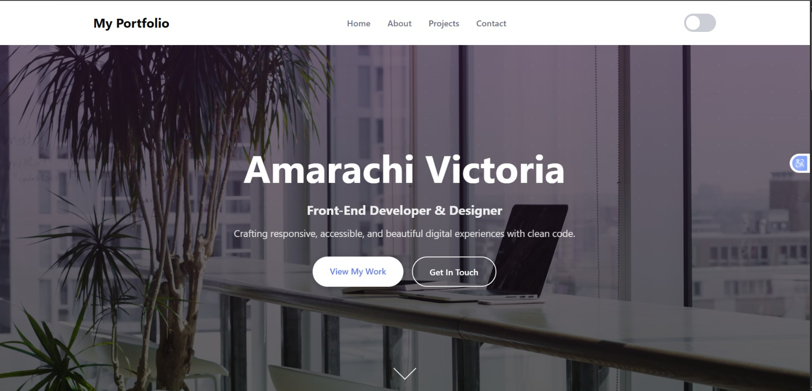
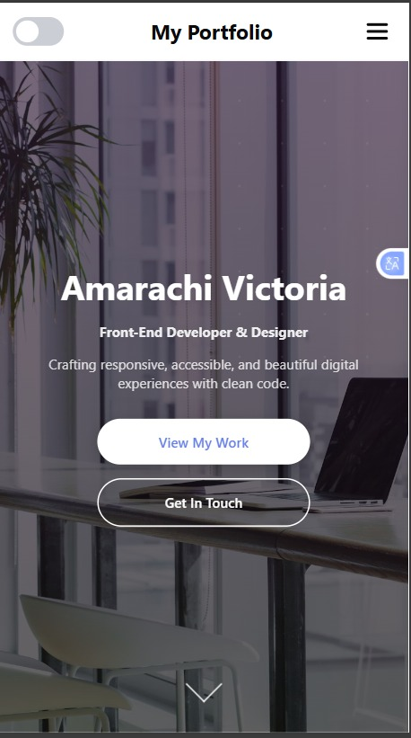

# Portfolio Website

## Overview
This is my personal portfolio website showcasing my projects, skills, and experience as a frontend developer and technical support enthusiast.

## Problem It Solves
A portfolio provides a centralized place to:
- Showcase projects
- Highlight skills
- Present professional identity to recruiters

## Features
- Project showcase section
- Responsive design
- Clean and modern UI
- A toggle for switching between lite and dark mode

## Problems I Solved
- Structured content for easy navigation
- Designed a clean interface to improve readability
- Ensured responsiveness across devices

## Preview

## Technologies Used
- HTML
- CSS

## How to Use
1. Open the website
2. Navigate through sections
3. View projects and information
4. Contact me on social media using their respective icons

## Future Improvements
- Add blog/technical writing section
- Improve animations and interactions
- Integrate contact functionality

## Lessons Learned
- Personal branding through web development
- UI/UX design principles
- Structuring a professional portfolio

## Live Demo
[View Live Project](https://amarachi-victoria.github.io/Portfolio-Website/)
